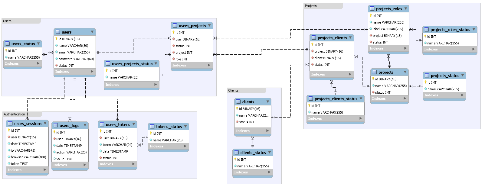

# Authentication Database



> The data model is composed of 4 schemas: Users, Authentication, Clients and Projects.
>
> The model allows the user to have access to multiple systems or projects, making it easier to implement an SSO (Single sign-on).
>
> Each project can be linked to more than one client.
>
> 1. The Users schema relates to the Authentication schema and the Projects schema. In this scheme it is possible to inform the projects that the user references. The user can be on two different client projects.
>
> 2. The Authentication scheme is related to user access control.
>
> 3. The Customers scheme is just a basic customer record that can be improved according to each need.
>
> 4. The Projects schema makes the relationship with both the Customers schema and the Users schema. It also distinguishes the possible access levels for each project.

### Adjustments and improvements

The project is still under development and the next updates will focus on the following tasks:

- [x] Data Model Modeling
- [x] Script for creating the database
- [x] Docker-compose and dockerfile with script required to view the database
- [ ] Insert mass of data to facilitate testing
- [ ] Separate schemas into specific databases
- [ ] Separate schemas into specific databases
- [ ] the users_logs table must be in a document-oriented database

## 💻 Prerequisites

Before you start, check the requirements:

* To view and manipulate the model (ER_Diagram/model.mwd), the MySQL Workbench program is required.
* Have Docker installed to access the structured database.

## 🚀 Installing

Follow these steps:

Linux and macOS:
```
<installation_command>
```

Windows:
```
<installation_command>
```

## ☕ Using

Follow these steps:

```
<Example of use>
```

## 🤝 Colaboradores

We thank the following people who contributed to this project:

<table>
  <tr>
    <td align="center">
      <a href="#">
        <br>
        <sub>
          <b>Erickson Tavares</b>
        </sub>
      </a>
    </td>
  </tr>
</table>